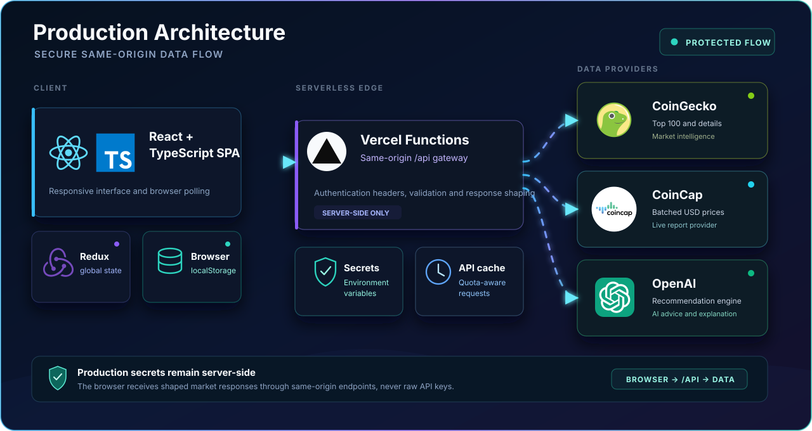

<p align="center">
  
</p>

<p align="center">
  <a href="https://cryptonite-amber.vercel.app">
    
  </a>
  <a href="https://github.com/itaygoldenberg/Cryptonite">
    
  </a>
  <a href="https://www.linkedin.com/in/itay-goldenberg/">
    
  </a>
</p>

<p align="center">
  <a href="#features">Features</a>
  &nbsp;&middot;&nbsp;
  <a href="#architecture">Architecture</a>
  &nbsp;&middot;&nbsp;
  <a href="#technologies">Technology stack</a>
  &nbsp;&middot;&nbsp;
  <a href="#running-locally">Local setup</a>
</p>

> [!NOTE]
> This project was created as the second project of the John Bryce Full Stack Web Developer course.

## Overview

Cryptonite presents live data about the top 100 cryptocurrencies, draws real-time price reports, and provides AI-powered buying advice in one responsive single page application.

<table>
  <tr>
    <td align="center" width="20%"><strong>100</strong><br /><sub>market assets</sub></td>
    <td align="center" width="20%"><strong>5</strong><br /><sub>tracked coins</sub></td>
    <td align="center" width="20%"><strong>20</strong><br /><sub>live readings</sub></td>
    <td align="center" width="20%"><strong>1s</strong><br /><sub>browser updates</sub></td>
    <td align="center" width="20%"><strong>AI</strong><br /><sub>market advice</sub></td>
  </tr>
</table>

| Project detail | Implementation |
|---|---|
| Market coverage | Top 100 cryptocurrencies by market capitalization |
| Live reporting | Up to five selected coins with the latest 20 readings |
| State management | Redux Toolkit with persistent selections in `localStorage` |
| API security | Same-origin Vercel Functions keep Production secrets outside the browser bundle |
| Deployment | Vercel with SPA routing and protected API endpoints |

## Contents

- [Links](#links)
- [Features](#features)
- [Architecture](#architecture)
- [Technologies](#technologies)
- [Project structure](#project-structure)
- [APIs](#apis)
- [Running locally](#running-locally)
- [Vercel API setup](#vercel-api-setup)
- [Production build](#production-build)
- [Author](#author)

## Links

| Resource | Link |
|---|---|
| Live application | [cryptonite-amber.vercel.app](https://cryptonite-amber.vercel.app) |
| GitHub repository | [itaygoldenberg/Cryptonite](https://github.com/itaygoldenberg/Cryptonite) |
| Author | [Itay Goldenberg on LinkedIn](https://www.linkedin.com/in/itay-goldenberg/) |

## Features

### Navigation

The application includes Home, Reports, AI Advice and About pages. The navbar also includes a case-insensitive coin search field.

### Home page

The Home page displays the top 100 coins. Each card shows the coin image, symbol, name, a More Info button and a selection switch.

The search filters the already loaded list locally by coin name or symbol, so typing does not create additional API requests.

### More Info

More Info displays the current price in USD, EUR and ILS. Details are loaded once per coin and then kept in the card state.

### Selected coins

Users can select up to five coins for the Reports and AI Advice pages. Selecting a sixth coin opens a replacement dialog. The selected coin IDs are stored in `localStorage`, so the switches remain selected after the browser is reopened.

### Reports page

Reports displays one live chart containing all selected coins. The chart checks for new data once per second and keeps the latest twenty readings. CoinCap requests are batched for all selected coins, and saved readings remain visible after API failures.

### AI Advice page

The AI Advice page lists the selected coins. Each coin can be sent to the ChatGPT API with the following market fields:

```text
name
current_price_usd
market_cap_usd
volume_24h_usd
price_change_percentage_30d_in_currency
price_change_percentage_60d_in_currency
price_change_percentage_200d_in_currency
```

The response contains a short recommendation and an explanation paragraph.

### About page

The About page includes project information, technologies, a personal photo and contact links.

## Architecture

<p align="center">
  
</p>

Production secrets are read only by the Vercel Functions. They are not included in the React source, browser bundle, GitHub repository or submission ZIP.

## Technologies

<table>
  <tr>
    <td align="center" width="25%"><br /><strong>React</strong><br /><sub>19.2</sub></td>
    <td align="center" width="25%"><br /><strong>TypeScript</strong><br /><sub>6.0</sub></td>
    <td align="center" width="25%"><br /><strong>Redux Toolkit</strong><br /><sub>2.12</sub></td>
    <td align="center" width="25%"><br /><strong>React Router</strong><br /><sub>7.18</sub></td>
  </tr>
  <tr>
    <td align="center"><br /><strong>Axios</strong><br /><sub>1.13</sub></td>
    <td align="center"><br /><strong>Recharts</strong><br /><sub>3.10</sub></td>
    <td align="center"><br /><strong>Vite</strong><br /><sub>8.1</sub></td>
    <td align="center"><br /><strong>CSS3</strong><br /><sub>Responsive UI</sub></td>
  </tr>
  <tr>
    <td align="center" width="33%"><br /><strong>Vercel Functions</strong><br /><sub>Protected API layer</sub></td>
    <td align="center" width="33%"><br /><strong>Git</strong><br /><sub>Version control</sub></td>
    <td align="center" width="33%"><br /><strong>OpenAI API</strong><br /><sub>AI recommendations</sub></td>
  </tr>
</table>

| Area | Technologies |
|---|---|
| Frontend | React 19, TypeScript 6, CSS |
| State and routing | Redux Toolkit, React Router |
| Data and visualization | Axios, Recharts |
| Tooling | Vite |
| Hosting and API layer | Vercel, Vercel Functions |

## Project structure

```text
api/                    Protected Vercel API routes
scripts/                Local API-key obfuscation helper
src/
|-- components/
|   |-- coins-area/      CoinCard, SearchBox, LimitDialog
|   |-- layout-area/     Layout, Header, Menu, Routing
|   |-- pages-area/      Home, Reports, AiAdvice, About, Page404
|-- models/              CoinModel, CoinDetailsModel, AiAdviceModel
|-- redux/               coins-slice, selected-slice, search-slice, store
|-- services/            CoinService, AiService, LocalApiService
|-- utils/               AppConfig and local key decryption
vercel.json             Production routing and SPA fallback
```

Redux stores the coin list, selected coins and search term globally so navigation between pages does not require another coin-list request.

## APIs

<table>
  <tr>
    <td align="center" width="33%">
      <br />
      <strong>CoinGecko</strong><br />
      <sub>Market list, coin details and AI market inputs</sub>
    </td>
    <td align="center" width="33%">
      <br />
      <strong>CoinCap</strong><br />
      <sub>Batched live USD prices for Reports</sub>
    </td>
    <td align="center" width="33%">
      <br />
      <strong>OpenAI</strong><br />
      <sub>Recommendation and explanation generation</sub>
    </td>
  </tr>
</table>

| Purpose | Provider |
|---|---|
| Top 100 coins | CoinGecko `/coins/markets` |
| More Info details | CoinGecko `/coins/{id}` |
| AI market data | CoinGecko `/coins/{id}` |
| Live report prices | CoinCap `/assets` |
| AI recommendation | OpenAI `/v1/chat/completions` |

CoinCap is used for the live report and was approved as the project's real-time price provider. Prices are matched by symbol because CoinGecko and CoinCap use different coin ID formats.

Create a CoinCap API key from the [CoinCap Pro Dashboard](https://pro.coincap.io/dashboard). For Production, store the raw key only as the `COINCAP_API_KEY` Vercel Environment Variable.

## Running locally

Clone the repository and install the dependencies:

```bash
git clone https://github.com/itaygoldenberg/Cryptonite.git
cd Cryptonite
npm install
```

### Full Vercel development

The recommended local setup uses the same protected API architecture as Production. Install the Vercel CLI and run:

```bash
npm install -g vercel
vercel login
vercel dev
```

Vercel prints the local URL, normally `http://localhost:3000`.

### Local run with encrypted API keys

This optional workflow lets the evaluator run the complete app with `npm start`, without a `.env` file and without storing the original CoinCap or OpenAI key in the source code.

> [!WARNING]
> The generated `enc:` strings are reversible obfuscation for local evaluation. Never commit them, publish them or include them in a submission ZIP.

1. Generate the encrypted CoinCap value:

   ```bash
   npm run encrypt:key -- CoinCap
   ```

   When the terminal displays `Paste the API key:`, paste the original CoinCap key and press Enter. The command prints a new value beginning with `enc:`. Copy that entire value, including the `enc:` prefix.

2. Generate the encrypted OpenAI value:

   ```bash
   npm run encrypt:key -- OpenAI
   ```

   Paste the original OpenAI key at the prompt, press Enter, and copy the complete printed value beginning with `enc:`.

3. Open `src/utils/app-config.ts` and find these exact placeholder lines:

   ```ts
   const ENCRYPTED_COINCAP_API_KEY = "enc:  ";
   const ENCRYPTED_OPENAI_API_KEY = "enc:  ";
   ```

4. Replace only the text between the quotation marks with the matching generated value. The result should look like this:

   ```ts
   const ENCRYPTED_COINCAP_API_KEY = "enc:GENERATED_COINCAP_VALUE";
   const ENCRYPTED_OPENAI_API_KEY = "enc:GENERATED_OPENAI_VALUE";
   ```

   The command output already contains `enc:`, so do not add a second `enc:` prefix. Do not paste either original key directly into `app-config.ts`.

5. Start the local application:

   ```bash
   npm start
   ```

   Vite opens the app at `http://localhost:5173`. In Development mode, the application decrypts the two local values in the `AppConfig` constructor and uses the restored keys for CoinCap Reports and OpenAI Advice. CoinGecko does not require a key.

6. Before committing, publishing or creating a submission ZIP, restore both lines to `"enc:  "`. The generated strings are reversible obfuscation intended only for local evaluation; Production continues to use the protected Vercel Environment Variables.

## Vercel API setup

The API runs in a Vercel Function. Production API keys are stored in Vercel Environment Variables and are never placed in React source code, the browser bundle, GitHub or the ZIP. Vercel uses raw server-side values, not the optional `enc:` values.

From the project root, connect the project and deploy:

```bash
vercel
```

In the Vercel dashboard, open **Project Settings > Environment Variables** and add these Production variables:

```text
COINCAP_API_KEY
OPENAI_API_KEY
```

Enter the real values only in the Vercel dashboard. Do not use a `VITE_` prefix for secret variables because `VITE_` values are exposed to the browser.

Deploy again after adding the variables:

```bash
vercel --prod
```

The live API architecture is:

```text
Browser -> same-origin /api Vercel Function -> CoinGecko/CoinCap/OpenAI
```

The Function caches CoinGecko and CoinCap responses and requests CoinCap at most once every five seconds for Reports. Vercel Hobby Functions are free within the plan limits. The Hobby plan is intended for personal, non-commercial projects.

## Production build

```bash
npm run build
```

The production files are generated in the `dist` folder. Do not include `node_modules`, `.env`, `dist` or `.git` in the submitted ZIP archive.

## Author

<p align="center">
  <strong>Itay Goldenberg</strong><br />
  Full Stack Developer Student
</p>

<p align="center">
  <a href="https://github.com/itaygoldenberg">
    
  </a>
  <a href="https://www.linkedin.com/in/itay-goldenberg/">
    
  </a>
</p>

<p align="center">
  Built as part of the John Bryce Full Stack Web Developer course.
</p>
